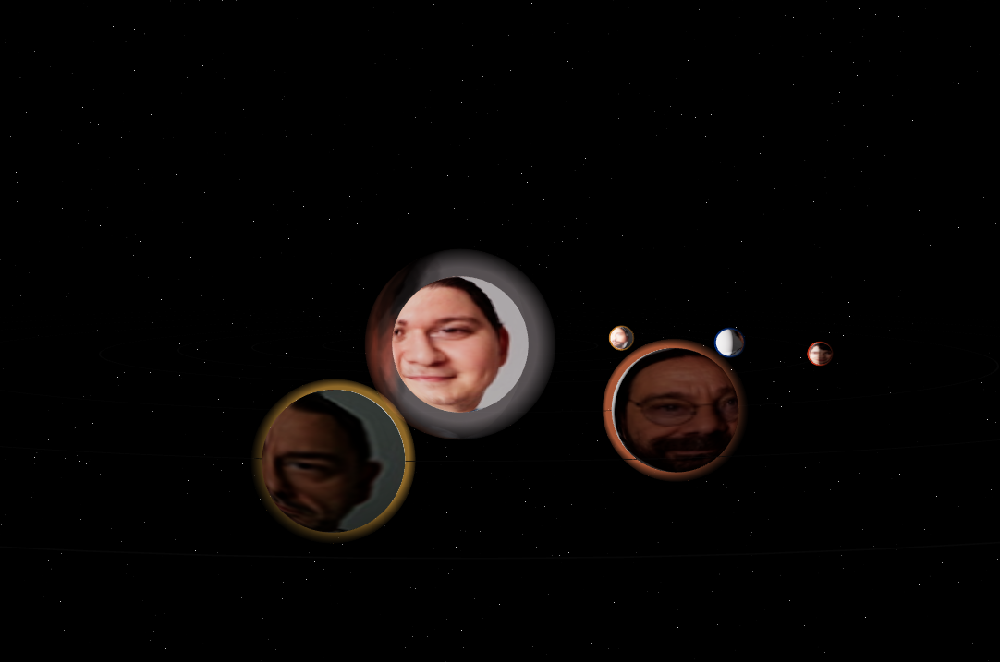

# Mucize Doktor


A 3D solar system visualization themed after the Turkish TikTok meme "Berhayat Sistemi", built with React Three Fiber.



---

### Setup

1. **Install dependencies:**

   ```bash
   npm install
   ```

2. **Run the development server:**

   ```bash
   npm run dev
   ```

3. **Build for production:**
   ```bash
   npm run build
   ```
